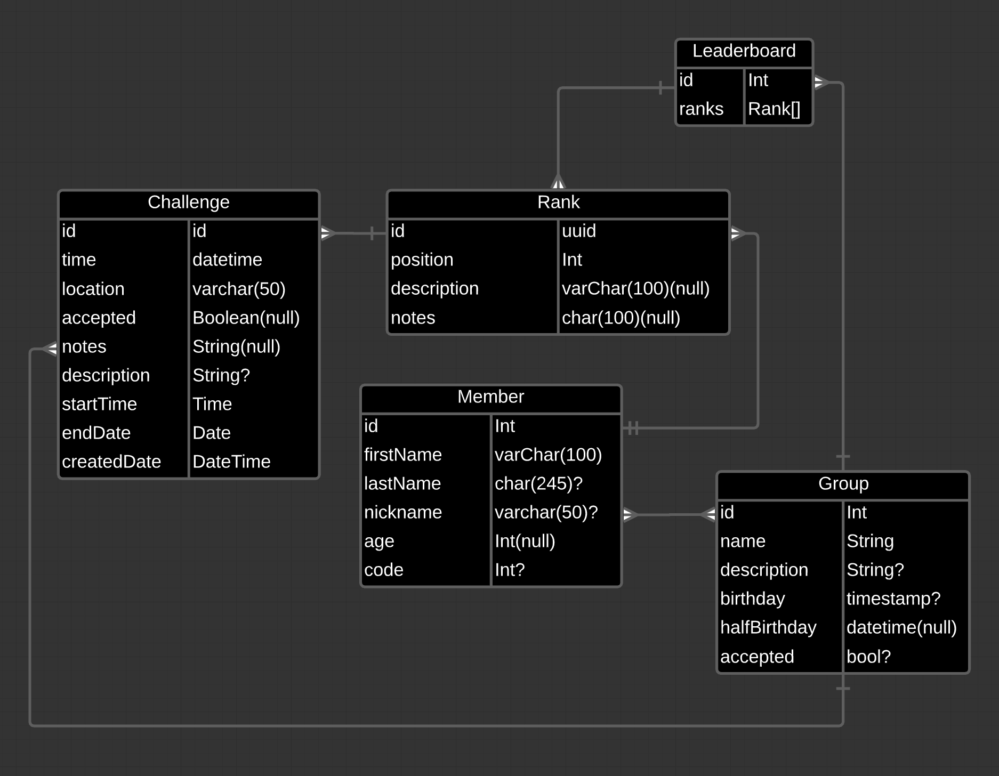

<div align="center">
<br />
<br />
<h1>lucid-dreams</h1>
<p>A CLI to convert a Lucidchart ERD to a Prisma schema file</p>
<a href="https://www.npmjs.com/package/lucid-dreams">

</a>
<a href="https://www.npmjs.com/package/lucid-dreams">

</a>
</div>

- [Overview](#overview)
  - [Installation](#installation)
  - [Usage](#usage)
  - [Supported Lucidchart Shapes](#supported-lucidchart-shapes)
    - [Entity Relationship (2 columns)](#entity-relationship-2-columns)
      - [Shape Structure](#shape-structure)
      - [Example](#example)

# Overview

[Lucidchart](https://lucid.co/product/lucidchart) allows you to create an [Entity Relationship Diagram (ERD)](https://www.lucidchart.com/pages/er-diagrams), which is a great way to visualize and mange your [database schema](https://www.lucidchart.com/pages/database-diagram/database-schema). It also allows you to export your ERD as a "CSV of Shape Data" CSV file.

[Prisma](https://www.prisma.io/) is an [ORM](https://www.prisma.io/docs/concepts/overview/prisma-in-your-stack/is-prisma-an-orm#what-are-orms) for [Node.js](https://nodejs.org/en/) and [TypeScript](https://www.typescriptlang.org/), and it's been an awesome developer experience for me personally.

This CLI will take a Lucidchart "CSV of Shape Data" file as input, and output a [Prisma Schema file](https://www.prisma.io/docs/concepts/components/prisma-schema) 😎. Before the `schema.prisma` file is generated, [prisma format](https://www.prisma.io/docs/reference/api-reference/command-reference#format) is run against the file.

## Installation
```shell
npm install lucid-dreams
```
## Usage

```shell
npx lucid-dreams --prisma ~/path/to/lucidchart/data.csv
```
The `--prisma` (or `-p`) flag means we will convert the Entity Relationship Diagram to a `schema.prisma` file. Here is the example with the `-p` flag:

```shell
npx lucid-dreams -p ~/path/to/data.csv
```

## Supported Lucidchart Shapes

### Entity Relationship (2 columns)

Create a 2 column Shape in your Lucidchart ERD.

#### Shape Structure

The label in the header section of the Lucidchart Shape will be the **table name**. The first column should be the database **column name** ([prisma field](https://www.prisma.io/docs/reference/api-reference/prisma-schema-reference/#model-fields)), and the second column should be it's [data type](https://www.prisma.io/docs/reference/api-reference/prisma-schema-reference/#model-field-scalar-types).

#### Example

Let's create a `Member` and a `Group` model. A `Group` has many `Members`, and a `Member` has one `Group`.



The models above are then converted to the following [Prisma models](https://www.prisma.io/docs/concepts/components/prisma-schema/data-model). If you have a field called `id` the `@id @default(autoincrement())` attribute will automatically be included.

```ts
model Member {
  id        Int      @id @default(autoincrement())
  name      String
  birthDate DateTime
  accepted  Boolean
  Group     Group?   @relation(fields: [groupId], references: [id])
  groupId   Int?
}

model Group {
  id      Int      @id @default(autoincrement())
  name    String
  members Member[]
}
```

I can't take all the credit though, `prisma format` also

> Formats the Prisma schema file, which includes validating, formatting, and persisting the schema. | [Source](https://www.prisma.io/docs/reference/api-reference/command-reference#format)

Much love to them.